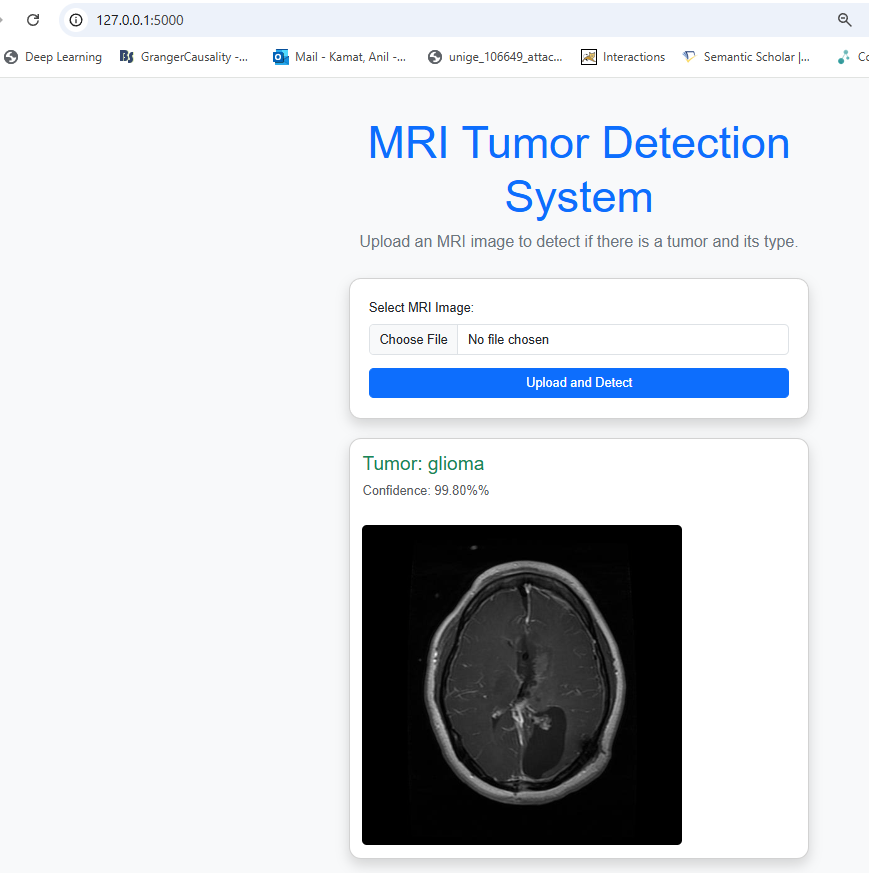

# Brain Tumor Detection from fMRI 

This project uses a VGG16 deep learning model to detect three types of Brain tumors from fMRI images. 
It also contains deployment scripts that can be hosted locally. 
#### An example of the project run successfully in local host is shown below: 

##### NOTE: the trained model hasn't been uploaded due to its large size. 
